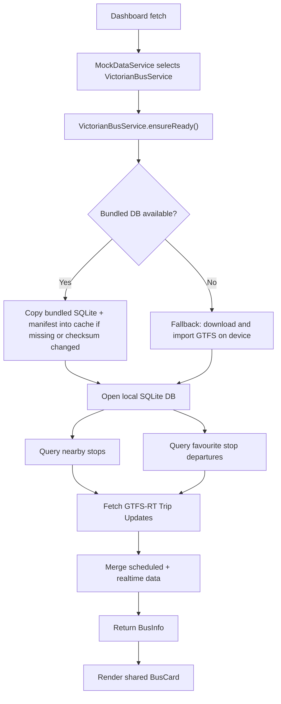

# Victorian Bus Architecture

This document describes the current Victorian bus implementation in `myLatest`, how static and realtime data are fetched, and how the app decides between bundled data and fallback download/import.

## Overview

The Victorian bus feature is built as a provider-specific transit pipeline that plugs into the shared bus card UI.

At a high level:

1. The dashboard asks the bus provider for `BusInfo`.
2. The Victorian provider ensures the static GTFS database is available locally.
3. The provider queries nearby and favourite bus stops from the local SQLite database.
4. The provider queries scheduled departures from the same local database.
5. The provider fetches GTFS-RT Trip Updates from Transport Victoria.
6. The provider overlays realtime predictions on top of scheduled departures.
7. The shared `BusCard` renders the result.

## Main Components

### Shared app-level bus contract

File: [myLatest/Models/BusModels.swift](/Users/fernandodeleon/dev/IOSDevelopment/myLatest/myLatest/Models/BusModels.swift)

- `TransportRegion` separates Queensland and Victorian transport selection.
- `BusProvider` separates the actual bus backend provider from region-level UI selection.
- `BusDataProviding` is the provider interface used by the dashboard fetch flow.
- `BusInfo`, `NearbyBusStop`, `BusDeparture`, and `BusAlert` are the shared UI-facing models used by the bus card.

This is what allows Queensland and Victoria to share the same bus UI while using different backend pipelines.

### Dashboard fetch routing

File: [myLatest/Services/MockDataService.swift](/Users/fernandodeleon/dev/IOSDevelopment/myLatest/myLatest/Services/MockDataService.swift)

- `busProvider(for:)` maps:
  - `.queensland` -> `BusService.shared`
  - `.victorian` -> `VictorianBusService.shared`
- `fetchDashboard(...)` calls the selected provider if the bus card is enabled.

This means Victorian bus is now a first-class dashboard data source rather than a placeholder card.

### Victorian provider

File: [myLatest/Services/VictorianBusService.swift](/Users/fernandodeleon/dev/IOSDevelopment/myLatest/myLatest/Services/VictorianBusService.swift)

Responsibilities:

- owns the Victorian provider identity: `.victorianPTV`
- ensures the static database is ready with `VictorianBusGTFSDatabase.shared.ensureReady()`
- loads nearby stops from the local database
- loads favourite stops from `FavouriteBusStopStore`
- loads scheduled departures from the local database
- fetches GTFS-RT Trip Updates from Transport Victoria
- merges realtime updates into scheduled departures
- returns `BusInfo` for the shared bus card

Important runtime behavior:

- static data is required before Victorian bus stop browsing and scheduled departures can work
- realtime is optional; if no valid API key is configured, scheduled departures still work
- realtime fetch failures degrade gracefully to scheduled-only departures

### Victorian static GTFS database

File: [myLatest/Services/VictorianBusGTFSDatabase.swift](/Users/fernandodeleon/dev/IOSDevelopment/myLatest/myLatest/Services/VictorianBusGTFSDatabase.swift)

This is the core static-data layer for Victoria.

Responsibilities:

- stores the local SQLite database path in the app caches directory
- installs a bundled prebuilt database from the app bundle when present
- compares bundled and cached manifests using `sha256`
- falls back to old on-device GTFS download/import when no bundled DB is available
- exposes queries for:
  - `searchBusStops`
  - `stopsInRegion`
  - `nearbyBusStops`
  - `departures`
- manages reset behavior for installed DB, sidecar files, extraction directory, and cached manifest

## Static Data Source Strategy

The app now prefers a bundled prebuilt SQLite database.

Bundled assets currently live in the repo at:

- [myLatest/db/transport/victoria/gtfs_victorian_bus.sqlite3](/Users/fernandodeleon/dev/IOSDevelopment/myLatest/myLatest/db/transport/victoria/gtfs_victorian_bus.sqlite3)
- [myLatest/db/transport/victoria/manifest.json](/Users/fernandodeleon/dev/IOSDevelopment/myLatest/myLatest/db/transport/victoria/manifest.json)

At runtime, `VictorianBusGTFSDatabase` checks for these resources in the app bundle. Because Xcode may flatten resource paths during packaging, the lookup supports both:

- `db/transport/victoria/...`
- app bundle root

### First-use install flow

When Victorian bus is used and the bundled DB is present:

1. `ensureReady()` calls `installBundledDatabaseIfNeeded()`.
2. The bundled DB is copied from the app bundle into the app caches directory.
3. The bundled manifest is copied into cache as well.
4. The database is opened locally and used for all static queries.

Console verification:

```text
Installing bundled Victorian bus DB from gtfs_victorian_bus.sqlite3
```

### Automatic bundled DB refresh

The bundled DB is considered newer if the bundled `manifest.json` checksum differs from the cached manifest checksum.

That means when a future app build ships with:

- a new `gtfs_victorian_bus.sqlite3`
- a matching new `manifest.json`

the app should automatically reinstall the newer bundled DB on next Victorian bus use, without requiring the user to press any reset button.

### Fallback path

If the bundled DB is not present, the app falls back to the older on-device importer:

1. download statewide GTFS ZIP from Transport Victoria
2. extract the bus slice
3. build the SQLite database locally

This fallback still exists for resilience and transition, but the intended production path is the bundled DB.

## Realtime Data Flow

Realtime is handled in [myLatest/Services/VictorianBusService.swift](/Users/fernandodeleon/dev/IOSDevelopment/myLatest/myLatest/Services/VictorianBusService.swift).

### Source

Transport Victoria GTFS-RT metro-bus Trip Updates endpoint:

- `https://api.opendata.transport.vic.gov.au/opendata/public-transport/gtfs/realtime/v1/bus/trip-updates`

### API key storage

The realtime key is stored in `UserDefaults` using:

- `VictorianBusService.realtimeAPIKeyDefaultsKey`

Settings entry point:

File: [myLatest/Views/Dashboard/SettingsView.swift](/Users/fernandodeleon/dev/IOSDevelopment/myLatest/myLatest/Views/Dashboard/SettingsView.swift)

### Request construction

The app currently sends the configured key in all supported/auth-related forms used during integration:

- `Ocp-Apim-Subscription-Key` header
- `KeyID` header
- `subscription-key` query item

This was done to tolerate documentation inconsistencies during implementation.

### Realtime merge logic

The provider:

1. fetches scheduled departures from the local SQLite database
2. fetches GTFS-RT Trip Updates
3. matches stop time updates by:
  - `stop_id`, or
  - `stop_sequence`
4. computes:
  - predicted departure time
  - delay seconds
  - departure status
  - minutes away

Status mapping uses:

- `On Time`
- `Early`
- `Late`
- `Scheduled`
- `Not Stopping`

If no realtime key is present, or GTFS-RT fails, the card still shows scheduled departures from the local database.

## Favourite Stops

File: [myLatest/Stores/FavouriteBusStopStore.swift](/Users/fernandodeleon/dev/IOSDevelopment/myLatest/myLatest/Stores/FavouriteBusStopStore.swift)

Favourite stops are scoped by provider.

That means:

- Queensland favourites and Victorian favourites can coexist
- stop ID collisions between providers do not break persistence
- the Victorian bus provider only reads favourites for `.victorianPTV`

This store is used both by Settings and by the Victorian provider when constructing the bus card.

## Settings and User Controls

File: [myLatest/Views/Dashboard/SettingsView.swift](/Users/fernandodeleon/dev/IOSDevelopment/myLatest/myLatest/Views/Dashboard/SettingsView.swift)

The Victorian bus section currently manages:

- `Show Bus Card`
- `Realtime API Key`
- `Favourite Stops`
- bundled/fallback static GTFS readiness state
- reset/reinstall of the installed Victorian bus database

Behavior:

- if the DB is ready, favourite-stop management is enabled
- if the DB is not ready, the user sees setup/install guidance
- if a bundled DB is available, the copy uses bundled wording and reset behavior
- if not, the section falls back to old download/import wording

The reset/reinstall actions do not fetch new network data when a bundled DB is available. They simply clear the installed cached copy so the bundled DB is restored on next use.

## Dashboard Rendering

File: [myLatest/Views/Dashboard/ContentView.swift](/Users/fernandodeleon/dev/IOSDevelopment/myLatest/myLatest/Views/Dashboard/ContentView.swift)

The dashboard:

- decides whether the train card should show
- decides whether the bus card should show
- renders the shared `BusCard`
- injects a provider-specific placeholder when bus data has not yet loaded

For Victoria:

- the real provider is `VictorianBusService`
- the placeholder provider is `.victorianPTV`
- the final rendered card uses the same UI component as Queensland

## Current Static DB Contents

The bundled Victorian SQLite database is a prebuilt local artifact produced outside the app.

Current characteristics:

- includes the bus-mode GTFS static data needed for stop browsing and scheduled departures
- includes `manifest.json` metadata used for bundle-to-cache refresh detection
- is intentionally not committed to Git because of size
- is expected to be regenerated offline and copied into the same repo path for future app releases

The app tracks the manifest, but the SQLite file itself is ignored in Git.

## End-to-End Runtime Sequence



## Verification Checklist

To verify the intended bundled architecture is working:

1. Install a build that contains the bundled DB and manifest.
2. Open Victorian transport settings or dashboard.
3. Confirm the console prints:
   - `Installing bundled Victorian bus DB from gtfs_victorian_bus.sqlite3`
4. Confirm the app does not go through the old 5-10 minute download/import flow.
5. Confirm Victorian favourite stops and nearby stops work.
6. Confirm scheduled departures appear even without a realtime key.
7. Confirm realtime predictions appear after entering a valid GTFS-RT key.

To verify reset/reinstall behavior:

1. Tap the Victorian reinstall/reset action.
2. Re-open Victorian bus.
3. Confirm the console again shows the bundled install log.
4. Confirm no Transport Victoria static GTFS re-download happens in the normal bundled path.

## Known Trade-offs

- The bundled SQLite database is large because it stores uncompressed schedule data and indexes for fast local queries.
- First use still requires copying a large DB from the app bundle into cache.
- The fallback downloader still exists and adds complexity, but it is useful until the bundled path is fully trusted.
- The Settings copy still contains some wording from the older download-first model and can be refined further.

## Release Workflow

Current intended release flow for Victorian bus static data:

1. Build a new Victorian bus SQLite DB offline.
2. Replace the local bundled DB at:
   - [myLatest/db/transport/victoria/gtfs_victorian_bus.sqlite3](/Users/fernandodeleon/dev/IOSDevelopment/myLatest/myLatest/db/transport/victoria/gtfs_victorian_bus.sqlite3)
3. Replace the matching manifest at:
   - [myLatest/db/transport/victoria/manifest.json](/Users/fernandodeleon/dev/IOSDevelopment/myLatest/myLatest/db/transport/victoria/manifest.json)
4. Build and ship the app.
5. Let the app auto-detect the new checksum and reinstall the newer bundled DB on next Victorian bus use.

This keeps runtime logic stable while moving the heavy GTFS transformation work out of the iOS app.
